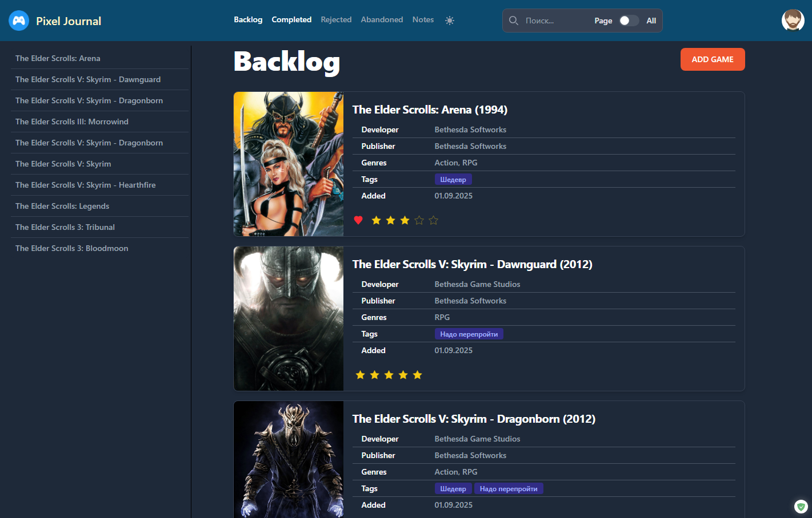

Pixel Journal
===================

The game tracking project: [Link on Netlify](https://pixel-journal.netlify.app/).

TODO
---------------------

### Лента пройденного по годам

> “15.08.2025 — завершил Hollow Knight”.

или 

> в 2025 играл в:
> - Hollow Knight  
> - Stalker 2

### Game Tracker Integration

Game Tracker должен регулярно отправлять время, потраченное на игру. Тогда можно либо просто обновлять время в карточке игры,
либо автоматом менять статусы - "регулярно играется" на "заброшено"

Bugs
---------------

- На странице заметки я прикрутил скроллбар заметки прямо к ней. Если браузер во все окно 1920x1080, то все выглядит
хорошо. Но если у браузере меньше высота, то появляется ВТОРОЙ скролл бар. Нужно его запретить. 

