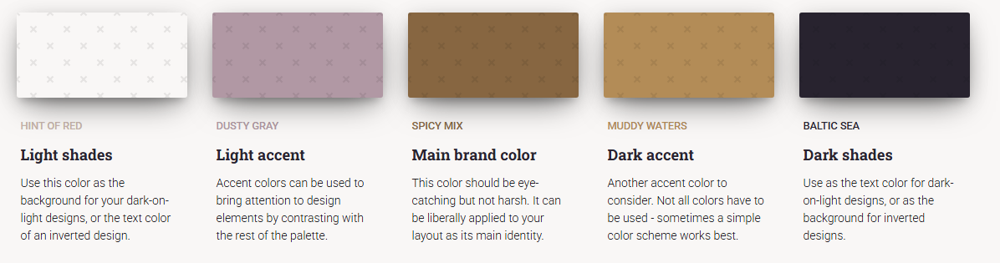

## https://colorhunt.co/ - 

множество вручную подобранных палитр

## https://www.tints.dev/

преобразовани палитр в tailwind-совместимые "градиенты"

## http://colormind.io/ 

палитра из пяти цветов, идея в которой такая, что она "переворачивается" для темной темы:

### Light shades
Use this color as the background for your dark-on-light designs, or the text color of an inverted design.

### Light accent
Accent colors can be used to bring attention to design elements by contrasting with the rest of the palette.

### Main brand color
This color should be eye-catching but not harsh. It can be liberally applied to your layout as its main identity.

### Dark accent
Another accent color to consider. Not all colors have to be used - sometimes a simple color scheme works best.

### Dark shades
Use as the text color for dark-on-light designs, or as the background for inverted designs.